#  PONG


Pong is a table tennis sports game featuring simple two-dimensional graphics, manufactured by Atari 
and originally released in 1972.


In this course we are going to build PONG in UNITY.

## Getting Started

First step is installing Unity. We installed Unity v. 2019.3 and for C# we are using Jetbrains Rider.

### 
After installing Unity, create a new project from Unity Hub. Set the following fields:  

  + Templates: Select 2D template  
  + Project Name: You can name as Pong or any other name  
  + Location: Select a folder   

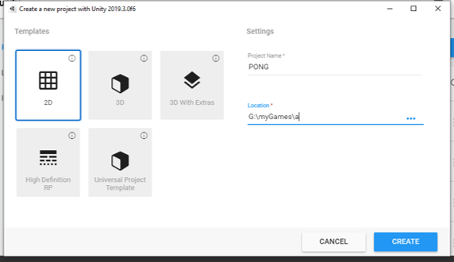

Now looking at the game Pong we should list first what we need to do.

+ Draw shapes to the screen (paddles and ball)
+ Control 2D position of paddles based on input
+ Collision detection between paddles and ball to deflect ball back toward opponent
+ Collision detection between ball and map boundaries to keep ball within vertical bounds and to detect score (outside horizontal bounds)
+ Sound effects when ball hits paddles/walls or when a point is scored for flavor
+ Scorekeeping to determine winner


## Drawing Shapes to the Screen

When you first start Unity, you should first arrange your workspace so that you can work more efficiently. First select **"Tall"** from the tab in the top right corner as seen in the image below.

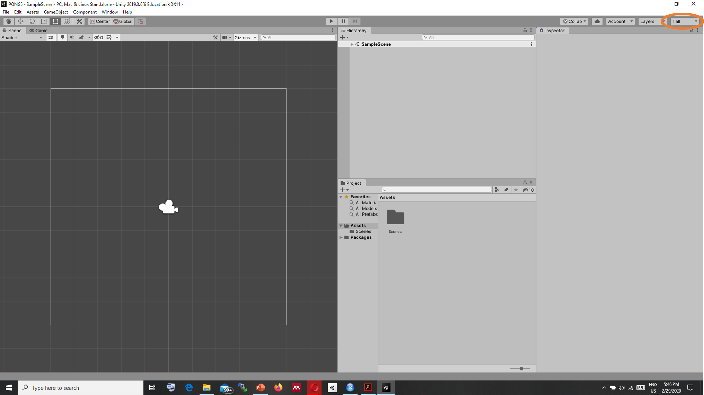

You can drag the **Game window** to the bottom of the **Screen window** to have a workspace similar to the image.

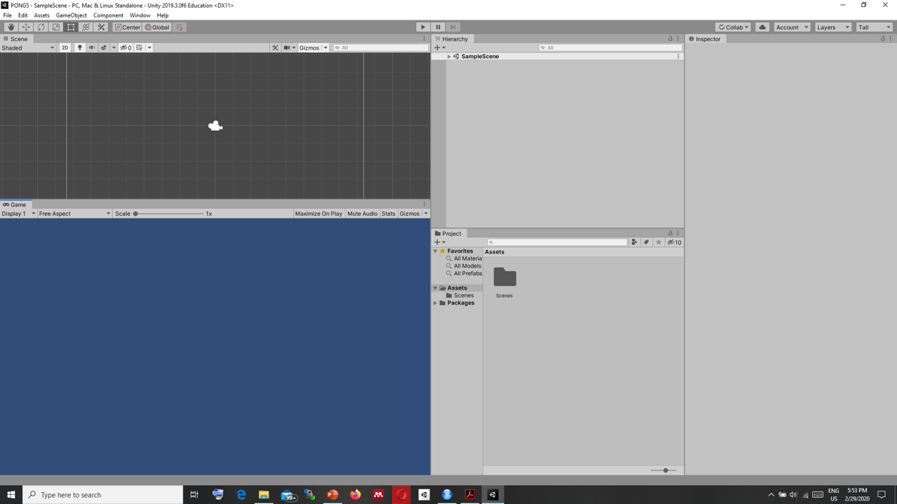

Now from the bottom of the **Game window** set the aspect ratio of the game. Aspect ratio adjusts the resolution of the game and ensures it looks same in all the devices.

Set the aspect ratio as Standalone 1024 X 768.

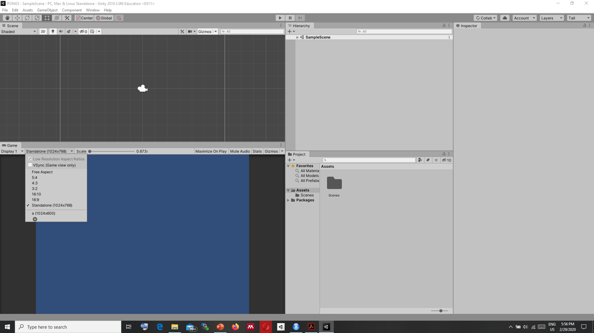

Now in Unity window we have five windows open.

* Scene Window: Here we control the geometries that we are creating. You can manipulate objects here.
* Game window: Here you play your games and inspect if everything works as expected.
* Hierarchy: Here is the objects that are in the scenes.
* Project: Project window holds your files such as assets, scripts etc.
* Inspector: In the inspector window you can access properties of all object that you are manipulating.

First let's rename and save our scene. In the **Project window** select SampleScene and rename it as Game. After the change Unity will ask you to reload the scene.

Now we can click to camera and change the background color to black from the **Inspector window**.

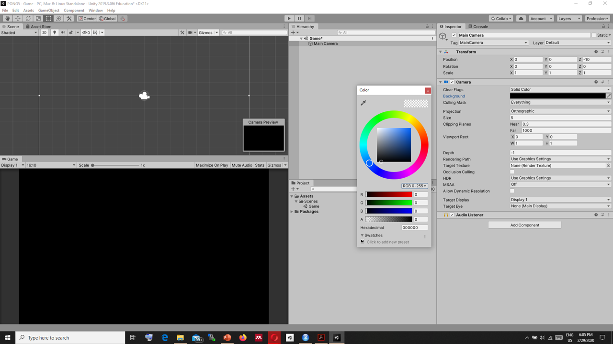

Now, we are going to create the sprites that we will use in our game. Sprites are 2D graphics that are used in the games. For the two paddle and the ball used in the game we will use a square sprite.

Right click **Project window** from the menu click >Create>Sprites>Square

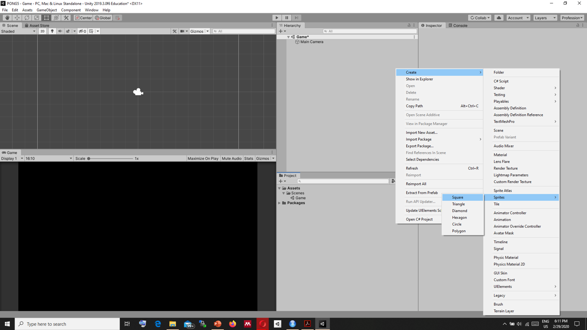

We will create our players by using the square sprite. First drag square sprite into the hierarchy window and name it as Player 1.

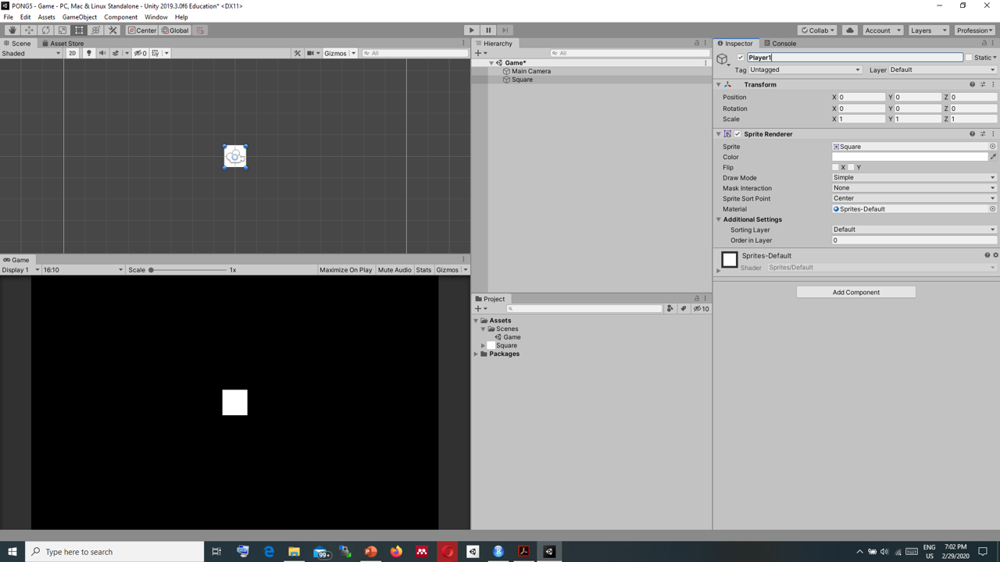

Next, we need to scale the sprite so that it becomes a rectange. Select player 1 sprite and from the inspector window, set X scale to 0.5 and y scale to 2.


Player1 should be at the left side of the screen so let's change the position of the Player1. Set the X position to -6.4.

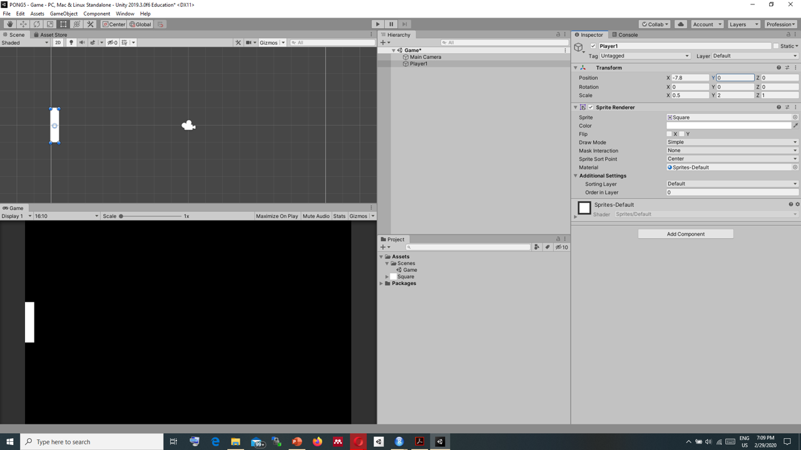

Next, we should create Player 2. To do this, right click on Player 1 and select duplicate. From the inspector window, change the name to "Player2" and X position to 6.4 to move Player 2 to the right side of the screen.


Lastly, we should create the ball from the sprite. Drag square to **Hierarchy window**. Click over the sprite and change the name to ball. Next, change the scale of X and Y to 0.3.

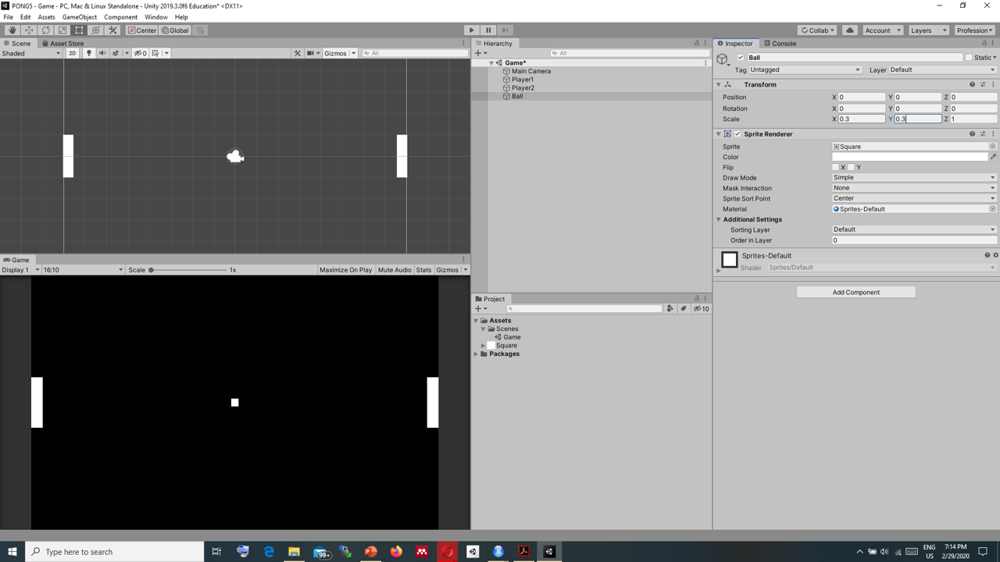

And to gather Player1 and Player2 in one folder create an empty GameObject by right clicking **Hierarchy window** >Create Empty.
Name it as Paddles and drag Player1 and Player2 into it.

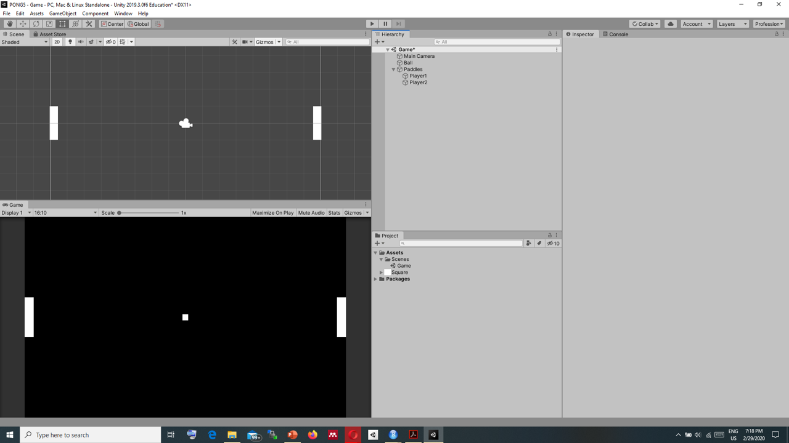


## User Input

In the last step, we have created our paddles and the ball. However, they are static and they don't move with input. So let's connect the paddles to user input.

First, we should setup the controls to be used in the game.

From Edit Menu click >Edit>Project Settings.

Select Input Manager from the left side of the window. And duplicate Vertical Axes by right clicking over it.

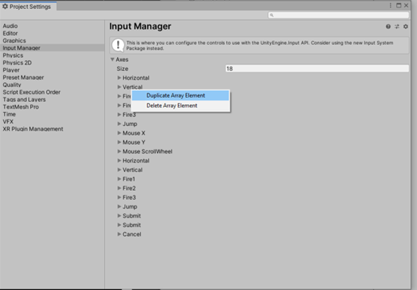

Change the vertical Axes to Player1 by changing the name. Player1 will use w for up and s for down. So set the **Negative Button** as s and set **Positive Button** as w. Delete alt negative and alt positive buttons.

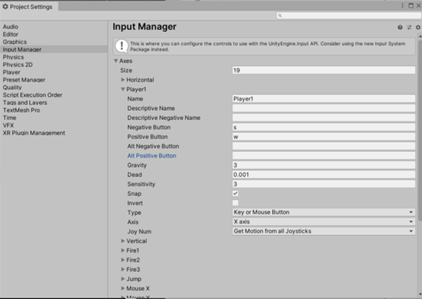

Similarly, change the other vertical axes as Player2 and set the **Negative Button** as down and set **Positive Button** as up. Delete alt negative and alt positive buttons.

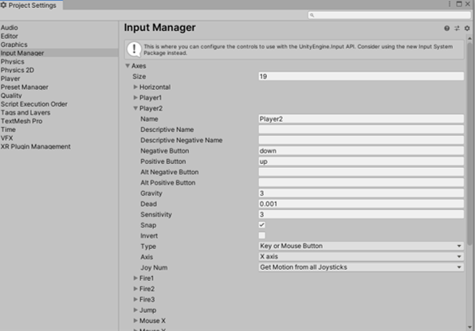

To control the paddles using the input buttons we should create a C# script. Right Click on Project Window and >Create>C# Script

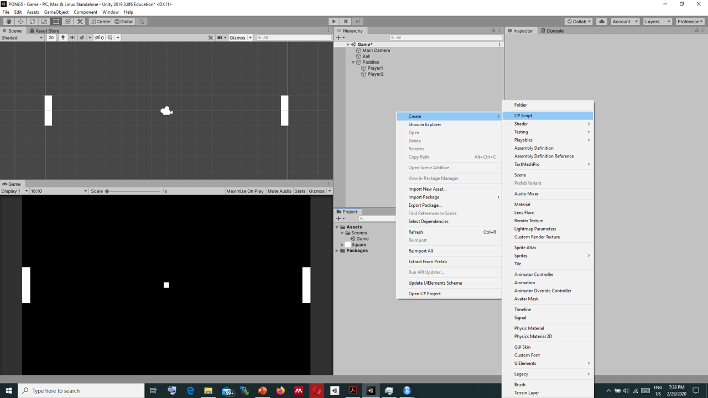

Name the script as Paddle and double click it. Double clicking a script file will bring up C# editor. It can be Jetbrains rider or Visual Studio Code according to your installation.


First, we should setup our variables. We will use three variables.

- _speed: holds the speed of the movement of the paddles
- player1: refers GameObject of Player1
- player2: refers GameObject of Player1

```c#
[SerializeField] private float _speed = 4f;
[SerializeField] GameObject player1;
[SerializeField] GameObject player2;
```
SerializeField in Unity means any variable that we have created will be accessible in the Unity interface. For more info: https://docs.unity3d.com/ScriptReference/SerializeField.html

After setting up our variable we can create Update() method.


```c#
// player1 - left player - movements
float verticalInput1 = Input.GetAxis("Player1");
Vector3 direction1 = new Vector3(0, verticalInput1, 0);
player1.transform.Translate(Time.deltaTime * _speed * direction1);
```
Here verticalInput1 receives the movement from the Player1 axes that we have created. According to the values we get, we create a direction1 vector3 which only receives values for Y axis since our player1 only moves up and down. And finally we move player1 every second.

We repeat the same code for player2:
```c#
// Player 2 - right player - movements 
float verticalInput2 = Input.GetAxis("Player2");
Vector3 direction2 = new Vector3(0, verticalInput2, 0);
player2.transform.Translate(Time.deltaTime * _speed * direction2);
```
Now we need to associate Paddle script with PaddleS folder we have created. Drag the Paddle script from the **Project Window** to **Hierarchy Window** and drop it over the Paddles folder. Click on the Paddles folder and from the inspector window check if you can see Paddle (Script). Now drag Player1 from the **Hierarchy Window** to Player1 in Inspector and repeat this for Player2.

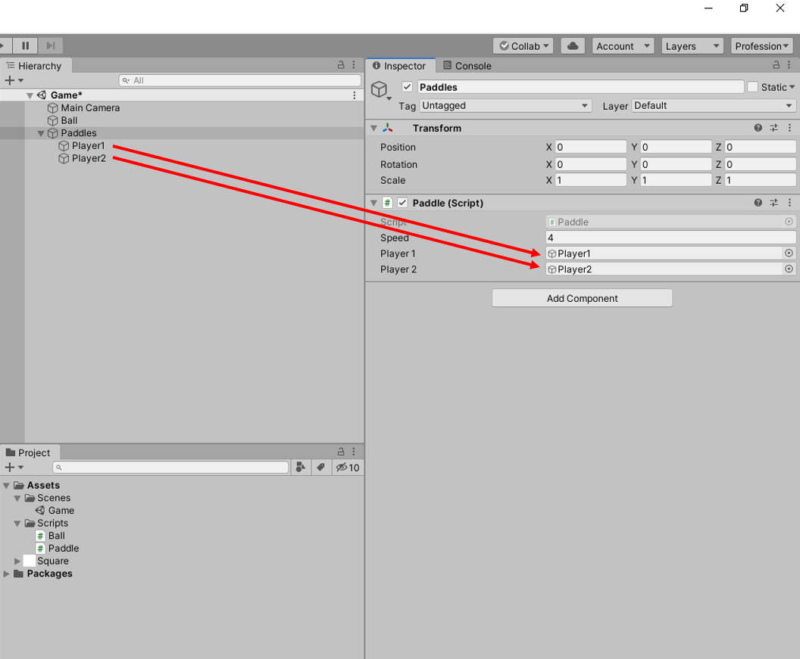

Finally, if we click the play button, the game starts and we can control our paddles.

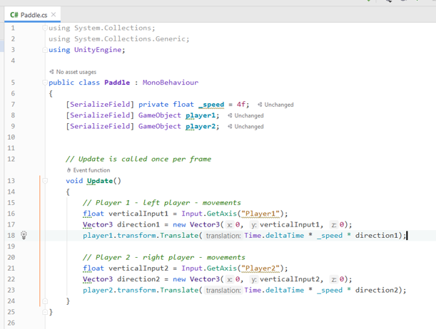

## Player Bounds

In the last section, we set up movements with the keyboard input. However, the paddles can go out of the bounds of the game space. We need to restrict the movement of the paddles to the screen size.

To achieve this we need to include two **if** statements to check if the paddles are at the top or bottom of the screen.

```c#
if (player1.transform.position.y < -3.9 && verticalInput1 < 0)
{
  verticalInput1 = 0;
}
else if (player1.transform.position.y > 3.9 && verticalInput1 > 0)
{
  verticalInput1 = 0;
}
```
Here the first if clause checks if player1's position is at the top of the screen which is -3.9, if it then the code sets the speed of the paddle to 0 which stops the movement. Similarly there is an another if statement which checks if player1 is at the bottom of the screen and again this also stops the paddle which ensures the paddle stays inside the screen.

We need to do the same check for player2 which makes the code like below.

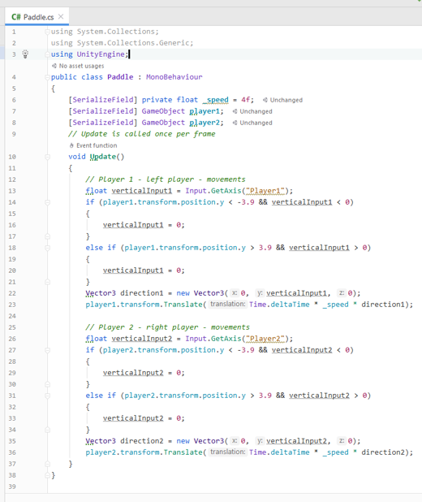

## Ball Movement

Now, we should make the ball move. For this we will create a ball script. Right click the **Project Window** >Create>C# Script and name it as ball. 

To make it tidier in the Project Window, create a folder and name it as Scripts and put Ball and Paddle script inside the Scripts folder.

We should start the game by hitting a key which will serve the ball. First, we should set the variables:

```c#
[SerializeField] private float _speed = 4f;
private bool serve = true;  // boolean to indicate serve action
private bool end = false;  // game ends
private Vector3 direction; // direction of the ball
```
- _speed: controls the speed of the ball.
- serve: Indicates the serve state
- end: indicates the end state which ends the game
- direction: direction of the ball as Vector3

Next we should create our code, if the state is serve and someone presses Enter the ball should start moving in a random direction.

```c#
if (Input.GetKeyDown(KeyCode.Return) && serve)
{
  direction = new Vector3(Random.Range(-4.0f, 4f), Random.Range(-8.0f, 8f), 0);
  serve = false;
}
if (!serve)
{
  transform.Translate(Time.deltaTime * _speed * direction);
}
```
After creating this script, we should drag the ball script over the ball GameObject. If we start the game, with a press to Return key the ball starts moving. However, since we did not set up the boundary to the ball it goes out of bounds.

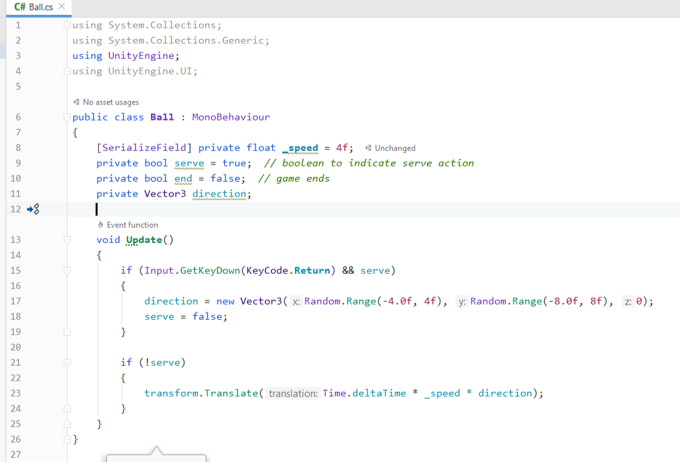

Next we will set up the boundary for the ball to bounce from the sides of the screen.

## Bouncing from the sides

For this the y position of the ball should be between -4.8 and 4.8. We will put two if conditionals; if the y position of the ball is bigger than 4.8, ball's direction should flip in the y direction. Similarly, if the y position of the ball is lesser than -4.8 ball's direction should flip in the y direction as well.


```c#
if (transform.position.y > 4.8 && direction.y > 0)
{
  direction.y = -direction.y;
}
if (transform.position.y < -4.8 && direction.y < 0)
{
  direction.y = -direction.y;
}
```
By adding these clauses will ensure that the ball stays in the boundary of the screen.

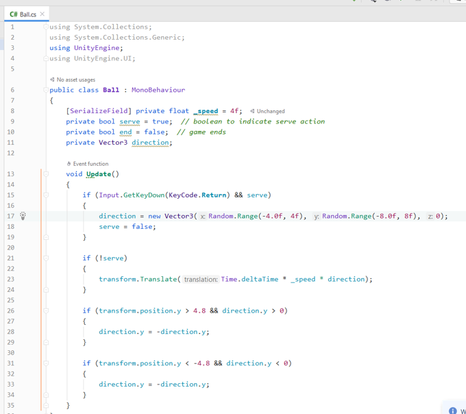

## Collider for Ball and Paddles

The game is still not playable since it does not collide with the paddles. We should add rigidbody2d and box collider to the player1 & player2 gameObjects and to the ball gameobject. To add rigidbody2d to player1, we click on the player1 in the **Hierarchy Window** and from the **Inspector Window** we click on add component and type rigidbody2d.


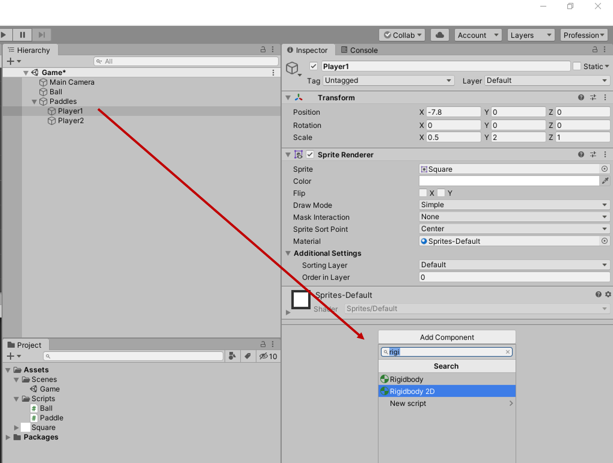


In the rigidbody2d, in Body Type tab select Kinematic. Kinematic ensures there is no gravity and all the movements occur according to our control.

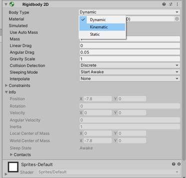

After adding rigidbody2d to all three gameObjects, we should add boxCollider2d for them as well. From the same place that we added rigidbody2d this time we add boxcollider2d. 


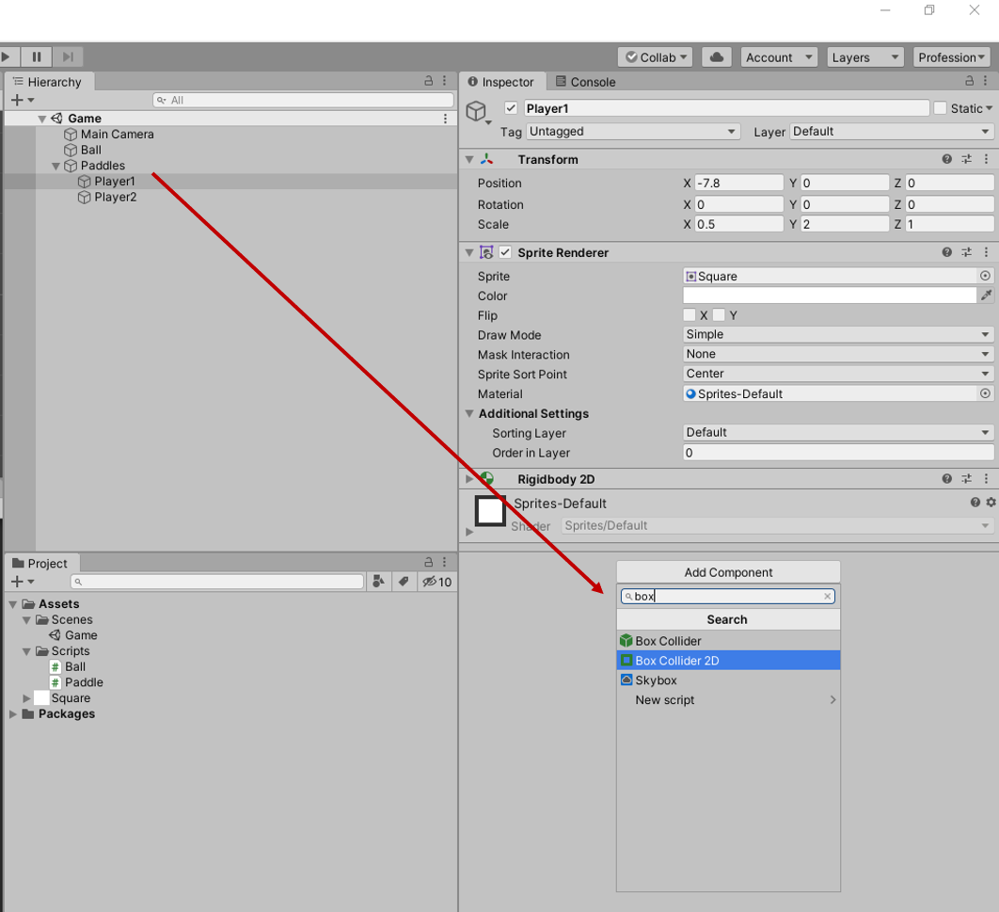

In the BoxCollider2d menu we should select IsTrigger option.


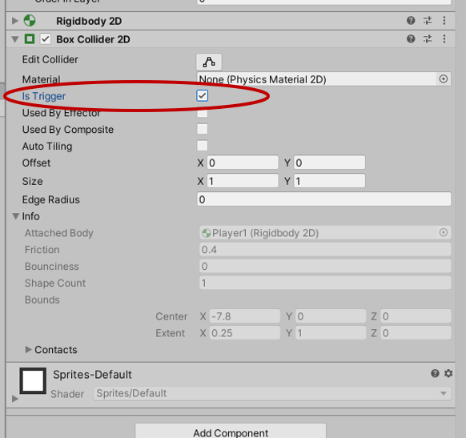

After adding rigidbody2d and boxcollider2d, now we should handle the code. Openning up ball script, we create OnTriggerEnter2D method. This methods calls up when two objects collide.

```c#
private void OnTriggerEnter2D(Collider2D other)
{
  direction.x = -direction.x;
}

```
This is a very simple method. It flips the direction of the ball when there is a collision between the ball and the paddle. So the new ball script is:

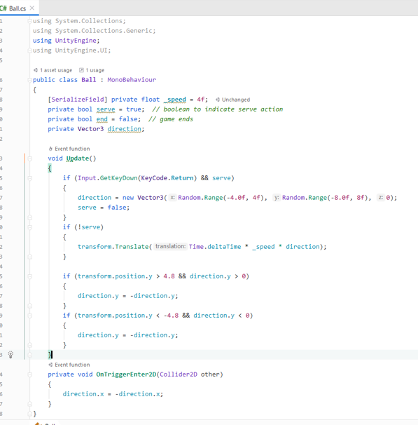

## Score

Next, we should be able to determine if there is a score and reset the game if there is a score, starting the game from the center of the screen with a key press again.

To keep up the score we create two new variables: 

```c#
private int player1Score = 0;
private int player2Score = 0;

```
We will include a code to check the position of the ball and if the ball's position is lesser than -6.7, means the ball has left the screen from the left thus player2 wins a score. If that happens we call the reset method and increase player2 score. If the score is 15 then the game ends, else the ball is returned to the center to be served again,
```c#
if (transform.position.x < -6.7)
{
  player2Score++;
  Reset();
  if (player2Score == 15)
  {
    end = true;
  } else {serve = true;}
}
```
Reset method just centers the ball.
```c#
private void Reset()
{
  transform.position = new Vector3(0,0,0);
}
```

After adding these codes and repeating the process for the right side, we have the scoring component of the game.

## Score update and UI

Next we need to show the scores in User Interface (UI). For this we need to Add Text to the Screen.

Right clicking **Hierarchy Window**, select >Create>UI>Text.

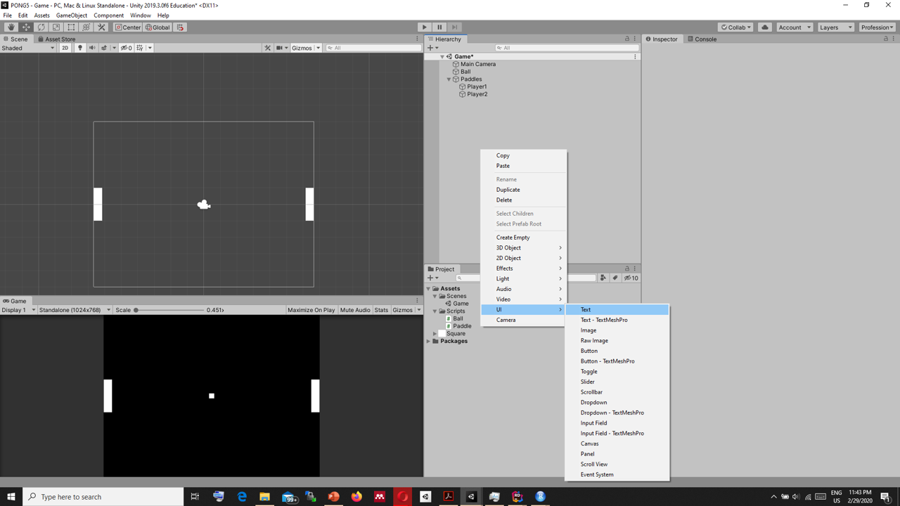

We should first name the UI Text as Player1ScoreText.Next we click on the anchor icon and select top, center. And adjust PosX as -150, Pos Y as -100, Text as 0, Font Size as 100, Horizontal Overflow as overflow and Vertical Overflow as overflow as in the image below.


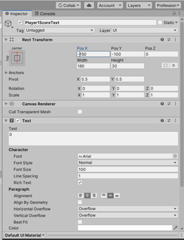

We should do the same for Player2, so right click on it and duplicate. Change its name as Player2ScoreText and PosX as 150.

After this step, we should associate this text and use it in our ball script. So we should add following variables to the code:

```c#
[SerializeField] private Text player1ScoreText;
[SerializeField] private Text player2ScoreText;
```
And these fields should be updated each time there is a score so we add the following code after the Reset function call.

```c#
player2ScoreText.text =  player2Score.ToString();
```

After adding these two code snippets we should click on Ball gameobject and drag Player1ScoreText and Player2ScoreText to its places.

Finally, our game mechanics works, next we will add sound that plays when there is a collision between the ball and the paddles.

## Sound

For the sound, you should download the sound file from Github. Place the paddle_hit file inside the assets folder. Drag the file into the **Hierarchy window**. 

Add a variable in ball script. 

```c#
[SerializeField] private AudioSource _paddleHit;
```
Add the code that plays the sound when there is a collision between the paddles and the ball inside the OnTriggerEnter2D method.
```c#
_paddleHit.Play();
```
Select the ball gameObject from the **Hierarchy Window** and drag the paddle_hit file to its place in ball script.

Now the game is ready, play it and enjoy your first game.

## Assignment

Now I want you to improve 5 aspects of the game. Some ideas:

- Change background color, add texture etc.
- Change colors/textures etc. of paddles
- Change some mechanics, the ball gets faster each time etc.
- Add AI to control the paddle – bonus points, hard option

To submit your work, you need to commit your changes to Github and send me a link of your username and project.


