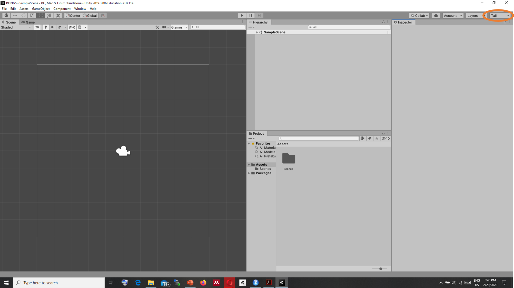
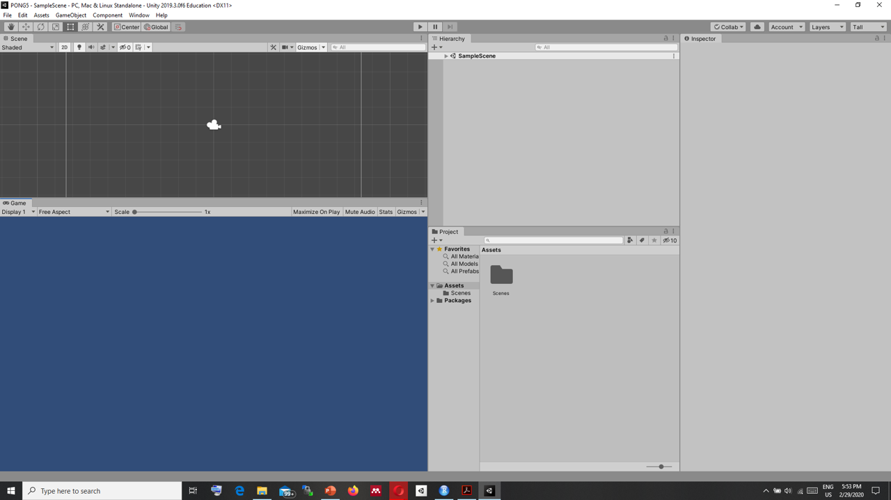
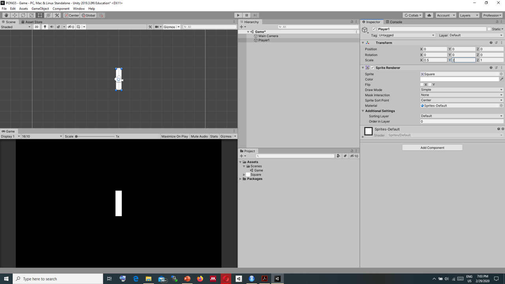
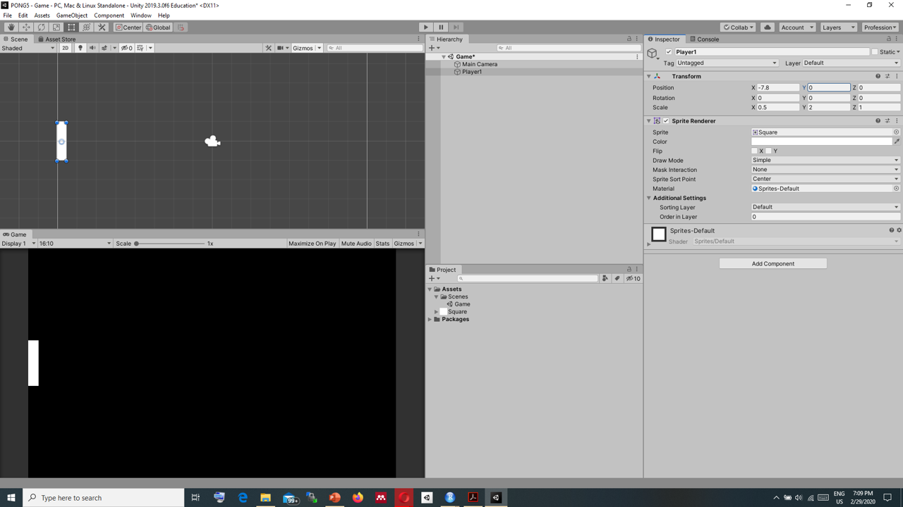
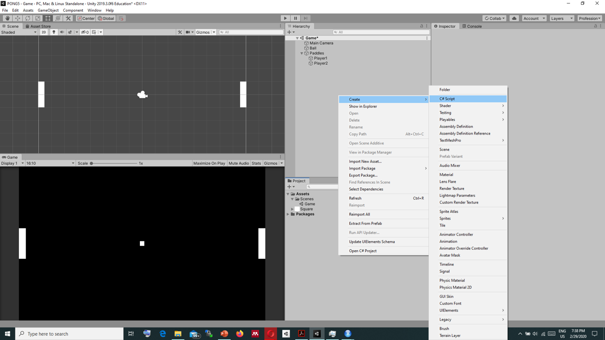
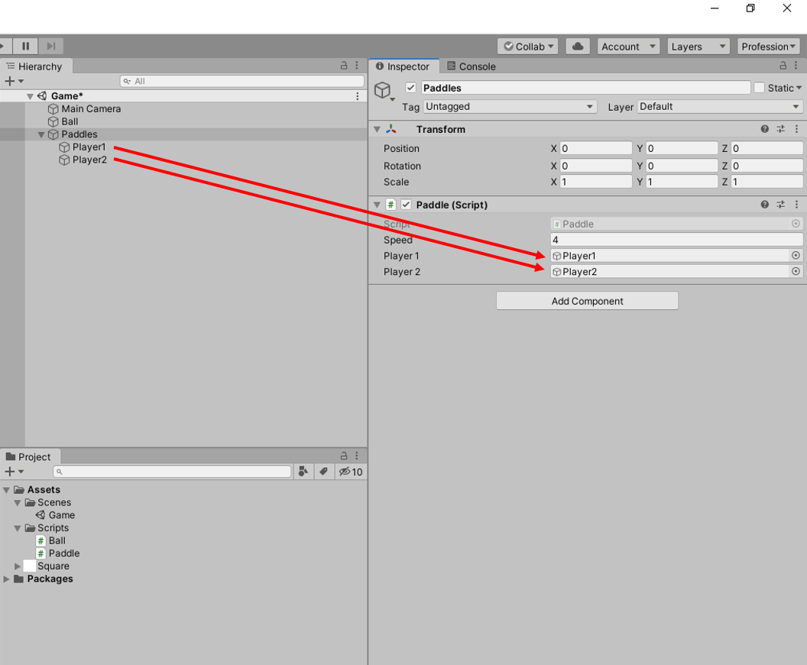
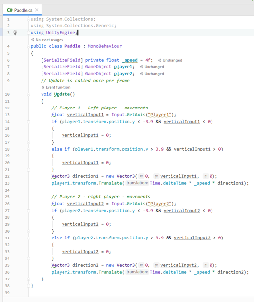

--- 
title: "ARC451 Game Design"
author: "Özgün Balaban"
site: bookdown::bookdown_site
output: bookdown::gitbook
documentclass: book
bibliography: [book.bib, packages.bib]
biblio-style: apalike
link-citations: yes
github-repo: rstudio/bookdown-demo
description: "ARC Lecture Notes"
---
# Syllabus {#intro}

## Description

This course is an introductory course on understanding what a game is, mechanics of games and game design process. This course aims to present workflows of game devel-opment through discussions of history of games, practical implementations of simple games and a project that includes all aspects game design. 

Throughout the course, each week is divided roughly to three sessions. In the first part, theory of game design will be discussed. In these sessions important games from history will be shown and they will be analyzed critically. Moreover, certain concepts related games will be discussed. In the second sessions, practical knowledge will be presented to the students. Here there will be an introduction to programming, introductions to tools that will be used such as Unity game engine. The second sessions will be followed by in class activity sessions which will include small assignments or project related group work time.

## Evaluation

### In-class assignments – Homework:  
In the practical sessions in class, there will be an implementation of a small game. These examples will be half-finished at the end of the practical sessions. Students are expected to finish these examples. Assistance will be provided.

### Critical analysis of a game:
Each student is expected to choose a game and analyze the underlying rule-structures of the game and then visually communicate them to the class.

### Final project:
For final project, students will form groups three and will create a game and present it. Development of the game will take place throughout the term and students will follow a workflow that is discussed during the lectures. The projects will be evaluated according to its creativity, programming value, and mechanics.

```{r include=FALSE}
# automatically create a bib database for R packages
knitr::write_bib(c(
  .packages(), 'bookdown', 'knitr', 'rmarkdown'
), 'packages.bib')
```

<!--chapter:end:index.Rmd-->

#  PONG


Pong is a table tennis sports game featuring simple two-dimensional graphics, manufactured by Atari 
and originally released in 1972.


In this course we are going to build PONG in UNITY.

## Getting Started

First step is installing Unity. We installed Unity v. 2019.3 and for C# we are using Jetbrains Rider.

### 
After installing Unity, create a new project from Unity Hub. Set the following fields:  

  + Templates: Select 2D template  
  + Project Name: You can name as Pong or any other name  
  + Location: Select a folder   


Now looking at the game Pong we should list first what we need to do.

+ Draw shapes to the screen (paddles and ball)
+ Control 2D position of paddles based on input
+ Collision detection between paddles and ball to deflect ball back toward opponent
+ Collision detection between ball and map boundaries to keep ball within vertical bounds and to detect score (outside horizontal bounds)
+ Sound effects when ball hits paddles/walls or when a point is scored for flavor
+ Scorekeeping to determine winner


## Drawing Shapes to the Screen

When you first start Unity, you should first arrange your workspace so that you can work more efficiently. First select **"Tall"** from the tab in the top right corner as seen in the image below.



You can drag the **Game window** to the bottom of the **Screen window** to have a workspace similar to the image.



Now from the bottom of the **Game window** set the aspect ratio of the game. Aspect ratio adjusts the resolution of the game and ensures it looks same in all the devices.

Set the aspect ratio as Standalone 1024 X 768.


Now in Unity window we have five windows open.

* Scene Window: Here we control the geometries that we are creating. You can manipulate objects here.
* Game window: Here you play your games and inspect if everything works as expected.
* Hierarchy: Here is the objects that are in the scenes.
* Project: Project window holds your files such as assets, scripts etc.
* Inspector: In the inspector window you can access properties of all object that you are manipulating.

First let's rename and save our scene. In the **Project window** select SampleScene and rename it as Game. After the change Unity will ask you to reload the scene.

Now we can click to camera and change the background color to black from the **Inspector window**.


Now, we are going to create the sprites that we will use in our game. Sprites are 2D graphics that are used in the games. For the two paddle and the ball used in the game we will use a square sprite.

Right click **Project window** from the menu click >Create>Sprites>Square


We will create our players by using the square sprite. First drag square sprite into the hierarchy window and name it as Player 1.


Next, we need to scale the sprite so that it becomes a rectange. Select player 1 sprite and from the inspector window, set X scale to 0.5 and y scale to 2.



Player1 should be at the left side of the screen so let's change the position of the Player1. Set the X position to -6.4.



Next, we should create Player 2. To do this, right click on Player 1 and select duplicate. From the inspector window, change the name to "Player2" and X position to 6.4 to move Player 2 to the right side of the screen.


Lastly, we should create the ball from the sprite. Drag square to **Hierarchy window**. Click over the sprite and change the name to ball. Next, change the scale of X and Y to 0.3.


And to gather Player1 and Player2 in one folder create an empty GameObject by right clicking **Hierarchy window** >Create Empty.
Name it as Paddles and drag Player1 and Player2 into it.


## User Input

In the last step, we have created our paddles and the ball. However, they are static and they don't move with input. So let's connect the paddles to user input.

First, we should setup the controls to be used in the game.

From Edit Menu click >Edit>Project Settings.

Select Input Manager from the left side of the window. And duplicate Vertical Axes by right clicking over it.


Change the vertical Axes to Player1 by changing the name. Player1 will use w for up and s for down. So set the **Negative Button** as s and set **Positive Button** as w. Delete alt negative and alt positive buttons.


Similarly, change the other vertical axes as Player2 and set the **Negative Button** as down and set **Positive Button** as up. Delete alt negative and alt positive buttons.


To control the paddles using the input buttons we should create a C# script. Right Click on Project Window and >Create>C# Script



Name the script as Paddle and double click it. Double clicking a script file will bring up C# editor. It can be Jetbrains rider or Visual Studio Code according to your installation.


First, we should setup our variables. We will use three variables.

- _speed: holds the speed of the movement of the paddles
- player1: refers GameObject of Player1
- player2: refers GameObject of Player1

```c#
[SerializeField] private float _speed = 4f;
[SerializeField] GameObject player1;
[SerializeField] GameObject player2;
```
SerializeField in Unity means any variable that we have created will be accessible in the Unity interface. For more info: https://docs.unity3d.com/ScriptReference/SerializeField.html

After setting up our variable we can create Update() method.


```c#
// player1 - left player - movements
float verticalInput1 = Input.GetAxis("Player1");
Vector3 direction1 = new Vector3(0, verticalInput1, 0);
player1.transform.Translate(Time.deltaTime * _speed * direction1);
```
Here verticalInput1 receives the movement from the Player1 axes that we have created. According to the values we get, we create a direction1 vector3 which only receives values for Y axis since our player1 only moves up and down. And finally we move player1 every second.

We repeat the same code for player2:
```c#
// Player 2 - right player - movements 
float verticalInput2 = Input.GetAxis("Player2");
Vector3 direction2 = new Vector3(0, verticalInput2, 0);
player2.transform.Translate(Time.deltaTime * _speed * direction2);
```
Now we need to associate Paddle script with PaddleS folder we have created. Drag the Paddle script from the **Project Window** to **Hierarchy Window** and drop it over the Paddles folder. Click on the Paddles folder and from the inspector window check if you can see Paddle (Script). Now drag Player1 from the **Hierarchy Window** to Player1 in Inspector and repeat this for Player2.



Finally, if we click the play button, the game starts and we can control our paddles.


## Player Bounds

In the last section, we set up movements with the keyboard input. However, the paddles can go out of the bounds of the game space. We need to restrict the movement of the paddles to the screen size.

To achieve this we need to include two **if** statements to check if the paddles are at the top or bottom of the screen.

```c#
if (player1.transform.position.y < -3.9 && verticalInput1 < 0)
{
  verticalInput1 = 0;
}
else if (player1.transform.position.y > 3.9 && verticalInput1 > 0)
{
  verticalInput1 = 0;
}
```
Here the first if clause checks if player1's position is at the top of the screen which is -3.9, if it then the code sets the speed of the paddle to 0 which stops the movement. Similarly there is an another if statement which checks if player1 is at the bottom of the screen and again this also stops the paddle which ensures the paddle stays inside the screen.

We need to do the same check for player2 which makes the code like below.



## Ball Movement

Now, we should make the ball move. For this we will create a ball script. Right click the **Project Window** >Create>C# Script and name it as ball. 

To make it tidier in the Project Window, create a folder and name it as Scripts and put Ball and Paddle script inside the Scripts folder.

We should start the game by hitting a key which will serve the ball. First, we should set the variables:

```c#
[SerializeField] private float _speed = 4f;
private bool serve = true;  // boolean to indicate serve action
private bool end = false;  // game ends
private Vector3 direction; // direction of the ball
```
- _speed: controls the speed of the ball.
- serve: Indicates the serve state
- end: indicates the end state which ends the game
- direction: direction of the ball as Vector3

Next we should create our code, if the state is serve and someone presses Enter the ball should start moving in a random direction.

```c#
if (Input.GetKeyDown(KeyCode.Return) && serve)
{
  direction = new Vector3(Random.Range(-4.0f, 4f), Random.Range(-8.0f, 8f), 0);
  serve = false;
}
if (!serve)
{
  transform.Translate(Time.deltaTime * _speed * direction);
}
```
After creating this script, we should drag the ball script over the ball GameObject. If we start the game, with a press to Return key the ball starts moving. However, since we did not set up the boundary to the ball it goes out of bounds.


Next we will set up the boundary for the ball to bounce from the sides of the screen.

## Bouncing from the sides

For this the y position of the ball should be between -4.8 and 4.8. We will put two if conditionals; if the y position of the ball is bigger than 4.8, ball's direction should flip in the y direction. Similarly, if the y position of the ball is lesser than -4.8 ball's direction should flip in the y direction as well.


```c#
if (transform.position.y > 4.8 && direction.y > 0)
{
  direction.y = -direction.y;
}
if (transform.position.y < -4.8 && direction.y < 0)
{
  direction.y = -direction.y;
}
```
By adding these clauses will ensure that the ball stays in the boundary of the screen.


## Collider for Ball and Paddles

The game is still not playable since it does not collide with the paddles. We should add rigidbody2d and box collider to the player1 & player2 gameObjects and to the ball gameobject. To add rigidbody2d to player1, we click on the player1 in the **Hierarchy Window** and from the **Inspector Window** we click on add component and type rigidbody2d.


In the rigidbody2d, in Body Type tab select Kinematic. Kinematic ensures there is no gravity and all the movements occur according to our control.


After adding rigidbody2d to all three gameObjects, we should add boxCollider2d for them as well. From the same place that we added rigidbody2d this time we add boxcollider2d. 


In the BoxCollider2d menu we should select IsTrigger option.


After adding rigidbody2d and boxcollider2d, now we should handle the code. Openning up ball script, we create OnTriggerEnter2D method. This methods calls up when two objects collide.

```c#
private void OnTriggerEnter2D(Collider2D other)
{
  direction.x = -direction.x;
}

```
This is a very simple method. It flips the direction of the ball when there is a collision between the ball and the paddle. So the new ball script is:


## Score

Next, we should be able to determine if there is a score and reset the game if there is a score, starting the game from the center of the screen with a key press again.

To keep up the score we create two new variables: 

```c#
private int player1Score = 0;
private int player2Score = 0;

```
We will include a code to check the position of the ball and if the ball's position is lesser than -6.7, means the ball has left the screen from the left thus player2 wins a score. If that happens we call the reset method and increase player2 score. If the score is 15 then the game ends, else the ball is returned to the center to be served again,
```c#
if (transform.position.x < -6.7)
{
  player2Score++;
  Reset();
  if (player2Score == 15)
  {
    end = true;
  } else {serve = true;}
}
```
Reset method just centers the ball.
```c#
private void Reset()
{
  transform.position = new Vector3(0,0,0);
}
```

After adding these codes and repeating the process for the right side, we have the scoring component of the game.

## Score update and UI

Next we need to show the scores in User Interface (UI). For this we need to Add Text to the Screen.

Right clicking **Hierarchy Window**, select >Create>UI>Text.


We should first name the UI Text as Player1ScoreText.Next we click on the anchor icon and select top, center. And adjust PosX as -150, Pos Y as -100, Text as 0, Font Size as 100, Horizontal Overflow as overflow and Vertical Overflow as overflow as in the image below.


We should do the same for Player2, so right click on it and duplicate. Change its name as Player2ScoreText and PosX as 150.

After this step, we should associate this text and use it in our ball script. So we should add following variables to the code:

```c#
[SerializeField] private Text player1ScoreText;
[SerializeField] private Text player2ScoreText;
```
And these fields should be updated each time there is a score so we add the following code after the Reset function call.

```c#
player2ScoreText.text =  player2Score.ToString();
```

After adding these two code snippets we should click on Ball gameobject and drag Player1ScoreText and Player2ScoreText to its places.

Finally, our game mechanics works, next we will add sound that plays when there is a collision between the ball and the paddles.

## Sound

For the sound, you should download the sound file from Github. Place the paddle_hit file inside the assets folder. Drag the file into the **Hierarchy window**. 

Add a variable in ball script. 

```c#
[SerializeField] private AudioSource _paddleHit;
```
Add the code that plays the sound when there is a collision between the paddles and the ball inside the OnTriggerEnter2D method.
```c#
_paddleHit.Play();
```
Select the ball gameObject from the **Hierarchy Window** and drag the paddle_hit file to its place in ball script.

Now the game is ready, play it and enjoy your first game.

## Assignment

Now I want you to improve 5 aspects of the game. Some ideas:

- Change background color, add texture etc.
- Change colors/textures etc. of paddles
- Change some mechanics, the ball gets faster each time etc.
- Add AI to control the paddle – bonus points, hard option

To submit your work, you need to commit your changes to Github and send me a link of your username and project.


<!--chapter:end:01-intro.Rmd-->

#  Flappy Bird


Flappy Bird is a mobile game developed by Vietnamese video game artist and programmer Dong Nguyen, under his game development company dotGears. The game is a side-scroller where the player controls a bird, attempting to fly between columns of green pipes without hitting them.


In this course we are going to build Flappy Bird in UNITY.

## Initial Setup

Setting up the aspect ratio

---
%## Assignment

%%Now I want you to improve 5 aspects of the game. Some ideas:

- Change background color, add texture etc.
- Change colors/textures etc. of paddles
- Change some mechanics, the ball gets faster each time etc.
- Add AI to control the paddle – bonus points, hard option
---

<!--chapter:end:02-Flappy.Rmd-->


# Critical Game Analysis

I am going to briefly cover how to do a critical game analysis. However, there are many ways, try to be 
creative.

Some parts of this text is taken from various sources.

References:
- https://ocw.mit.edu/courses/comparative-media-studies-writing/cms-300-introduction-to-videogame-studies-fall-2011/assignments/game-analysis/MITCMS_300F11_GameAnaGuide.pdf
- https://learn.canvas.net/courses/3/pages/level-3-dot-2-critical-analysis-of-games

## First step is selecting a game.

You need to first select a game for this study. Try to select a game that will help you in ideation phase for your project.
It can be because of the graphics, gameplay, controls, theme etc.


## Before you start analysing: play the game

- Play the game extensively

Try to complete the game, or at least familiarize yourself with all the modes. You
should master the game as much as you can. If you've played it before, play it
again, to have the game fresh in your mind—replay always helps achieving new
insights about the game. The time you should be playing the game varies from
game to game. In your analysis, be explicit about how you played the game, if
there are different options (e.g. level of difficulty, character that you used.)

- Take notes while you play.

It's good to keep track of things you come across in the game. What do you like?

What don't you like? Is there something that you did not expect? Does a specific
part of the game remind you of something else (another game, or a movie, or
some other event)? Taking notes of potential examples for your paper is also a
good habit. If you can have a corresponding savegame for reference, even better.

- You can take some help such as walktroughs.

Anyone can get stuck and might need help, especially if it prevents them from
getting far enough in the game (and therefore from playing it extensively). Cheat
codes, watching walkthrough videos, or having a friend play for you are ways to
help you know more about the game, but they should not be the predominant
mode in which you experience it. 

- Read what other people have written about the game


## Contextualize

Providing a frame of reference to understand your analysis is basic to make it
accessible to your reader, particularly if they are not familiar with the game.
Games, like any other media artifacts, are not produced in a void. They are the
product of their times: the technology available at the moment, the people who
made them, or other socio-cultural trends that marked that historical moment.

- Game Developer/Studio; Artists, Designers, Programmers, Writers (or whoever
is relevant).
The creative team of a game is important, particularly in the case where it
connects to other relevant games they worked on before or after this game. Some
development studios or designers have certain trademarks, or specialize on a
particular genre (e.g. Valve, Square Enix or Will Wright), so choosing one of their
games can mark a specific time in the evolution of their games, which might be
important to the context of your analysis.

- Game genre and related games
A game genre usually has a set of established conventions behind it, such as First
Person Shooters, adventure games, real-time strategy games or Role-Playing
Games. Establishing the game within a genre can help determine, for instance,
why it is like other games of the same type, or what is innovative about it. If the
game partakes of conventions from different genres, that can also be a way of
explaining what sets it apart from other games. The relations to other game
genres do not have to be exclusively digital--board and card games, as well as 
other traditional games, can be the origins of certain mechanics.
The game of your choice can relate to other games by any of the elements listed
on these guidelines: developer, genre, publisher, by being released at the same
time, similar mechanics, similar themes (e.g. space flight simulators), being part
of a franchise (e.g. Star Wars or Mario), using similar controls, games that it has
influenced or that later tried to copy it, etc.

- Technological context
What platform(s) was the game developed for? It is important to note which
version of the game you are playing, e.g. Assassin's Creed for the DS is a different
game from the PS3 version. The technology will determine, for instance, the
length of the game or whether there is an ending (think of arcade games in the
early 80s, where games typically did not end). In other cases, such as the Virtual
Boy or the Wii, the technology can also shape the way the way the game is played.

- Socio-historical context
When was the game made? It's different to analyze a game from the 70s, when
videogames were almost exclusively played in arcades, than a recent game, now
that videogames start to enjoy a more general acceptance in cultural terms.
Where was it released? A game released in the US in the mid 80s (after the socalled videogame crash) may not have had the same influence as a game released
in Europe (where videogames were played almost exclusively in home
computers).

- Audience
Who is the game intended for? Games can create communities around them, at
times fostered by the developers themselves. The fans of a particular game can be
a phenomenon worth studying in itself, for example, as creators of content for it,
as critics/reviewers, or as assistants to other players by providing walkthroughs
or strategy guides. Studying the game community in depth can veer away from
the textual analysis provided here, so be aware that if you study the community
you may not be analyzing the game itself. It is a perfectly valid analysis, but
different from the one proposed here.

- Relations to other media
Is the game part of a franchise, a tie-in with a work in another medium (e.g. Lost Via Domus, Wall-E)? Is it an adaptation of the work in another medium, or is it
only using the same characters and settings? Is it inspired by a situation or
premise of another medium (e.g. Dead Rising taking the zombies-in-a-mall
premise of Dawn of the Dead)? Does it incorporate and re-work pre-existing
stories (e.g. Too Human using Norse mythology as the basis for its story, but
transposing it to a high-tech world) Does it use other works as documentation,
background or inspiration (e.g. the writings of Ann Rynd as background
reference to Bioshock)?


## Game Overview

It is always good to explain briefly what you do in the game to someone who has
not played it or is not familiar with it. Do not always take your audience's
knowledge for granted, explain the game to them, so that they are aware of how
you understand it. Give your reader an idea of what gameplay is like.

- No. of Players (single player/multi-player/MMO)

Can you choose the number of players? Does it have different modes depending
on the number of players? If there is more than one player, do they play
simultaneously or do they take turns?

- Rules and goals of the game

Make a summary of the basic rules of the game, a summarized version of the
instructions, as it were. If the game has an end / a win state, what is it? If it does
not, it's also worth explaining whether it is an endless game, or whether there are
multiple goals, or whether the player is able to set their own goals/win state (e.g.

The Sims). Does the game have different modes, where the rules change slightly?

- Description of Gameplay: what do you do in the game?

Focus on the core mechanics: what are the most recurring actions in the game?

You can think of this in terms of verbs: what are the main verbs of the game? For
example, in Super Mario Bros. the verbs would be run, jump, pick up, slide

down, stomp. In Tetris, the verbs would be rotate, drop, clear.

- Spaces of the game

Where does the game take place? How does the player navigate the space? How
does the game encourage exploration of the space, if at all? Are there different
types of spaces, corresponding to different levels? Does the space or navigation
do anything that is not possible in the real world? How does the space of the
game relate to the space of the player?

- Aesthetics: general gameplay experience

This section is a tricky one, since your experience will probably be different from
other people's. Your skills or game knowledge affect the way you play the game.

You can contrast your own gameplay with that of other players by reading
walkthroughs or reviews. You can also compare how you played with the
experience intended by the developers, if you find interviews or postmortems
where they express that intention. Do not try to generalize your opinion--your

experience is valid as long as it is qualified. Do not guess what the intentions of
the game makers are from what you see in the game, you should have factual
evidence, so use concrete examples.

- Rules and Fiction

How is the setting presented outside and in the game? How does the game live up
to it? How does it establish the fictional world of the game? How does it relate to
the rules and goals of the game? If the game has a strong story component, you
may summarize its premise; however, you should avoid turning your analysis
into a retelling of the story of the game.

## Formal Elements

In this section, you have to identify the different game elements that make up the
game system, and establish the relationships between them.

- **Gameworld rules**
What model is the game trying to simulate? How does the gameworld work,
outside of the rules of the game? For instance, San Andreas in Grand Theft Auto:
San Andreas is a city where pedestrians walk on the side walk, cars run at
normal speed on the road and follow traffic rules, and the day/night cycle
changes every 20 minutes. This could be called a simulation of the real world,
within certain limits. Other examples can refer to the difference between what is
possible in the gameworld and what the player is allowed to do. For example, in
the main mode of Halo characters talk to each other in cut-scenes, but the player
cannot choose when to talk or what to say. What is possible or impossible in a
game is the direct result of decisions made in the design of the game, and you
have to be aware of those choices.
- **Simulation and Levels of Abstraction**
What level of abstraction is the game using? How nuanced is the simulation in
the game? For example, Diner Dash simulates the strategic aspects of
waitressing, where the key is to optimize your path to do the most things the least
amount of time, but does not include taking down people's orders and
memorized who ordered what. How complex is the simulation, depending on that
level of abstraction.
- **Game mechanics and resulting dynamics**
From the rules of the game described above, What are the main strategies? What
is their range (i.e. are there just a couple of strategies or is there a wide variety)?
Are there any emergent strategies that are possible but may not have been
predicted by the developers? Does the game accommodate different play styles?
Can the player save the game? If so, can the game be saved at any point, or does
the game regulate when to save the game?
- **The gap between the game and the player: Player character, mediation, interface design**
How does the player have agency in the gameworld? How is the information
displayed on the screen? Is the interaction menu-based (as in Sim City)? Is there
a player character who represents the player in the world? Is it a given character
or is it customizable? Can the player character die or not? Does the player
manipulate the objects directly, without a player character or avatar (e.g. in
puzzle games like Bejeweled)? Can the player select different entities in the world
at a time (as in real-time strategy games)? How is gameplay information 
conveyed through the visuals / audio?
- Difficulty levels and game balancing.
Are there different difficulty levels? How is the level of difficulty increased? Is it
well-balanced, i.e. the game becomes difficult at reasonable increases? What
proficiency does the game expect from the player? Is it easy to pick up, difficult to
master? How does the game teach you how to play it, if at all? Is there a tutorial,
or does the game introduce one new element on each level?

- Control schemes; control peripherals
Does the player have to type the commands of the game? Does it use the mouse/a
game controller/a special peripheral? Does the game allow different ways to
configure your controls? Does the game allow voice input (e.g. voice chat in an
MMO, or voice controls)? How do the controls affect and shape gameplay?

- Audiovisuals: visual design, sound design, music
What is the audiovisual style of the game? Does it evoke / imitate the style of
other media (e.g. painting, photography, cinema, classical music)? Does it use
other games as aesthetic reference (e.g. retro games)? What is the color scheme?
How do these audiovisual elements contribute to the fiction of the game? How do
they contribute to the mood of the game?

- Progression vs Emergence
Does the game force the player to follow a specific sequence? How does the game
guide the player to the correct action? Are there multiple paths? Are there
emergent behaviors, or is there room for emergent gameplay? How does the
game encourage players to experiment with it?

- Mods / Modes / Cheats / Hacks
You may be interested in surveying different gameplay modes, that may not be
the standard for most players, such as user-developed levels, or different modes
of the game (such as the no-fail mode of Rock Band 2, or the crash mode of
Burnout, or the multiplayer modes of Diablo 2). Cheats and game hacks have a
great potential as texts to analyze, since they can become commentaries on the
original game and reveal hidden or non-obvious aspects of the game.

## Round up your discussion
Remember to finish off the paper with a conclusion. Reiterate the main points of
your paper, what you want your reader to remember, the core of your paper in
brief. This is an opportunity to ratify your thesis statement, re-stating it and
summarizing how your evidence supports it. A conclusion can also address one of
the following points, based on your discussion.
- Why is this game relevant to the study of games?
- What is innovative about game? Can it be applied to other games?
- Open up to further questions that need addressing, in videogame theory, game
design, more game analysis, etc. 


<!--chapter:end:03-Analysis.Rmd-->


# Create With Code


Create with Code

https://learn.unity.com/course/create-with-code

## Unit 1 - Player Control

### Lesson 1.1 - Start your 3D Engines

1.Introduction

2.Make a course folder and new project

3.Import assets and open Prototype 1

4.Add your vehicle to the scene

5.Add an obstacle and reposition it

6.Locate your camera and run the game

7.Move the camera behind the vehicle

8.Customize the interface layout

9.Lesson Recap

### Lesson 1.2 - Pedal to the Metal

1.Introduction

2.Create and apply your first script

3.Add a comment in the Update() method

 - comments
 - methods
 - start method
 - update method
 
4.Give the vehicle a forward motion

 - transform.Translate(0,0,1);
 
5.Use a Vector3 to move forward

 - transform.Translate(Vector3.forward);
  
  6.Customize the vehicle’s speed
  
 - Time.deltaTime
 
7.Add RigidBody components to objects

Rigidbody

8.Duplicate and position the obstacles

### Lesson 1.3 - High Speed Chase  


1. Introduction  


2. Add a speed variable for your vehicle

- variable  
 public float speed = 5.0f;
 
3.Create a new script for the camera

4.Add an offset to the camera position

5.Make the offset into a Vector3 variable

6.Edit the playmode tint color

- Playmode Tint

7. Lesson Recap


### Lesson 1.4 - Step into the Driver's Seat

1.Introduction

2.Allow the vehicle to move left/right

3.Base left/right movement on input

4.Take control of the vehicle speed

5.Make vehicle rotate instead of slide

6.Clean your code and hierarchy

7.Lesson Recap


### Challenge 1 - Plane Programming

1.Introduction to Challenges

2.Challenge 1 Overview

3.The plane is going backward

4.The plane is going too fast

5.The plane is tilting automatically

6.The camera is in front of the plane

7.The camera is not following the plane

8.Bonus: The plane’s propeller does not spin


### Lab 1 - Project Design Document


1.Introduction

2.Understand what a Personal Project is

3.Review Design Doc examples

4.Complete your Project Concept V1

5.Complete your Project Timeline

6.Complete your MVP sketch

7.Recap


## Unit 2 - Player Control

### Lesson 2.1 - Player Positioning


#### Introduction

#### Create a new Project for Prototype 2
> The first thing we need to do is create a new project and import the Prototype 2 starter files.

1. Open Unity Hub and create a New project named “Prototype 2” in your course directory 
2. Click on the link to access the Prototype 2 starter files, then import them into Unity
3. Open the Prototype 2 scene and delete the SampleScene without saving
4. In the top-right of the Unity Editor, change your Layout from Default to your custom layout

#### Add the Player, Animals, and Food
> Let’s get all of our objects positioned in the scene, including the player, animals, and food.

1. If you want, drag a different material from Course Library > Materials onto the Ground object 
2. Drag 1 Human, 3 Animals, and 1 Food object into the Hierarchy
3. Rename the character “Player”, then reposition the animals and food so you can see them
4. Adjust the XYZ scale of the food so you can easily see it from above
#### Get the user’s horizontal input

> If we want to move the Player left-to-right, we need a variable tracking the user’s input.

1. In your Assets folder, create a “Scripts” folder, and a “PlayerController” script inside
2. Attach the script to the Player and open it
3. At the top of PlayerController.cs, declare a new public float horizontalInput 
4. In Update(), set horizontalInput =  Input.GetAxis(“Horizontal”), then test to make sure it works in the inspector
```{c#}
public float horizontalInput;

void Update()
{
  horizontalInput = Input.GetAxis("Horizontal");
}
```


#### Move the player left-to-right

> We have to actually use the horizontal input to translate the Player left and right.

1. Declare a new public float speed = 10.0f; 
2. In Update(), Translate the player side-to-side based on horizontalInput and speed
```{c#}
public float horizontalInput;
public float speed = 10.0f;

void Update()
{
  horizontalInput = Input.GetAxis("Horizontal");
  transform.Translate(Vector3.right * horizontalInput * Time.deltaTime * speed);
}


```

#### Keep the player inbounds
> We have to prevent the player from going off the side of the screen with an if-then statement.

1. In Update(), write an if-statement checking if the player’s left X position is less than a certain value
2. In the if-statement, set the player’s  position to its current position, but with a fixed X location


 ```{c#}
void Update()
{
  if (transform.position.x < -10)
  {
    transform.position = new Vector3(-10, transform.position.y, transform.position.z);
  }
}

```
#### Clean up your code and variables

> We need to make this work on the right side, too, then clean up our code.

1. Repeat this process for the right side of the screen
2. Declare new xRange variable, then replace the hardcoded values with them
3. Add comments to your code

 ```{c#}
public float xRange = 10;
void Update()
{
  // Keep the player in bounds
  if (transform.position.x < -xRange)
  {
    transform.position = new Vector3(-xRange, transform.position.y, transform.position.z);
  }
  if (transform.position.x > xRange)
  {
    transform.position = new Vector3(xRange, transform.position.y, transform.position.z);
  }
}

```

#### Lesson Recap

New Functionality

- The player can move left and right based on the user’s left and right key presses
- The player will not be able to leave the play area on either side

New Concepts & Skills

- Adjust object scale
- If-statements
- Greater/Less than operators

### Lesson 2.2 - Food Flight

#### Introduction

#### Make the projectile fly forwards
> The first thing we must do is give the projectile some forward movement so it can zip across the scene when it’s launched by the player.

1. Create a new “MoveForward” script, attach it to the food object, then open it
2. Declare a new public float speed variable;
3. In **Update()**, add transform.Translate(Vector3.forward * Time.deltaTime * speed);, then save
4. In the **Inspector**, set the projectile’s **speed** variable, then test

```{c#}
public float speed = 40.0f;

void Update()
{
  transform.Translate(Vector3.forward * Time.deltaTime * speed); 
}
```

#### Make the projectile into a prefab
> Now that our projectile has the behavior we want, we need to make it into a prefab it so it can be reused anywhere and anytime, with all its behaviors included.

1. Create a new “Prefabs” folder, drag your food into it, and choose **Original Prefab**
2. In PlayerController.cs, declare a new public GameObject projectilePrefab; variable
3. Select the Player in the hierarchy, then drag the object from your Prefabs folder onto the new Projectile Prefab box in the inspector
4. Try dragging the projectile into the scene at runtime to make sure they fly


#### Test for spacebar press
> Now that we have a projectile prefab assigned to PlayerController.cs, the player needs a way to launch it with the space bar.


1. In PlayerController.cs, in Update(), add an if-statement checking for a spacebar press:
if (Input.GetKeyDown(KeyCode.Space)) {
2. Inside the if-statement, add a comment saying that you should // Launch a projectile from the player

#### Launch projectile on spacebar press
> We’ve created the code that tests if the player presses spacebar, but now we actually need spawn a projectile when that happens

1. Inside the if-statement, use the  Instantiate method to spawn a projectile at the player’s location with the prefab’s rotation

```{c#}

if (Input.GetKeyDown(KeyCode.Space))
{
  Instantiate(projectilePrefab, transform.position, projectilePrefab.transform.rotation); 
}
```

#### Make animals into prefabs
> The projectile is now a prefab, but what about the animals? They need to be prefabs too, so they can be instantiated during the game.

1. Rotate all animals on the Y axis by 180 degrees to face down
2. Select all three animals in the hierarchy and Add Component > Move Forward 
3. Edit their speed values and test to see how it looks
4. Drag all three animals into the Prefabs folder, choosing “Original Prefab”
5. Test by dragging prefabs into scene view during gameplay


#### Destroy projectiles offscreen

> Whenever we spawn a projectile, it drifts past the play area into eternity. In order to improve game performance, we need to destroy them when they go out of bounds.

1. Create “DestroyOutOfBounds” script and apply it to the projectile
2. Add a new private float topBound variable and initialize it = 30;
3. Write code to destroy if out of top bounds if (transform.position.z > topBound) {
Destroy(gameObject); }
4. In the Inspector Overrides drop-down, click Apply all to apply it to prefab

```{c#}
private float topBound = 30.0f;

void Update() {
  if(transform.position.z > topBound) {
    Destroy(gameObject);
  }
}
```

#### Destroy animals offscreen
> If we destroy projectiles that go out of bounds, we should probably do the same for animals. We don’t want critters getting lost in the endless abyss of Unity Editor...


1. Create else-if statement to check if objects are beneath lowerBound:
else if (transform.position.z > topBound)
2. Apply the script to all of the animals, then Override the prefabs

```{c#}
private float topBound = 30.0f;
private float lowerBound = -10.0f;

void Update() {
  if(transform.position.z > topBound) {
    Destroy(gameObject);
  }  else if(transform.position.z < lowerBound) {
    Destroy(gameObject);
  }
}
```

#### Lesson Recap

New Functionality

- The player can press the Spacebar to launch a projectile prefab,
- Projectile and Animals are removed from the scene if they leave the screen

New Concepts & Skills

- Create Prefabs
- Override Prefabs
- Test for Key presses
- Instantiate objects
- Destroy objects 
- Else-if statements

### Lesson 2.3 - Random Animal Stampede

#### Introduction

#### Create a spawn manager

> If we are going to be doing all of this complex spawning of objects, we should have a dedicated script to manage the process, as well as an object to attach it to.


1. In the hierarchy, create an empty object called “SpawnManager” 
2. Create a new script called “SpawnManager”, attach it to the Spawn Manager, and open it
3. Declare new public GameObject[ ] animalPrefabs; 
4. In the inspector, change the Array size to match your animal count, then assign your animals by dragging them in

#### Spawn an animal if S is pressed

>We’ve created an array and assigned our animals to it, but that doesn’t do much good until we have a way to spawn them during the game. Let’s create a temporary solution for choosing and spawning the animals.


1. In Update(), write an if-then statement to instantiate a new animal prefab at the top of the screen if S is pressed
2. Declare a new public int animalIndex and incorporate it in the Instantiate call, then test editing the value in the Inspector

```{c#}
public GameObject[] animalPrefabs;
public int animalIndex;

void Update() {
  if(Input.GetKeyDown(KeyCode.S)) {
    Instantiate(animalPrefabs[animalIndex], new Vector3(0,0,20), animalPrefabs[animalIndex].transform.rotation);
  }
}
```

#### Spawn random animals from array

> We can spawn animals by pressing S, but doing so only spawns an animal at the array index we specify. We need to randomize the selection so that S can spawn a random animal based on the index, without our specification.

1. In the if-statement checking if S is pressed, generate a random int animalIndex  between 0 and the length of the array
2. Remove the global animalIndex variable, since it is only needed locally in the if-statement


```{c#}
public GameObject[] animalPrefabs;


void Update() {
  if(Input.GetKeyDown(KeyCode.S)) {
    int animalIndex = Random.Range(0, animalPrefabs.Length);
    Instantiate(animalPrefabs[animalIndex], new Vector3(0,0,20), animalPrefabs[animalIndex].transform.rotation);
  }
}
```

#### Randomize the spawn location

> We can press S to spawn random animals from animalIndex, but they all pop up in the same place! We need to randomize their spawn position, so they don’t march down the screen in a straight line.

1. Replace the X value for the Vector3 with Random.Range(-20, 20), then test
2. Within the if-statement, make a new local Vector3 spawnPos variable 
3. At the top of the class, create private float variables for spawnRangeX and spawnPosZ

```{c#}
public GameObject[] animalPrefabs;
private float spawnRangeX = 10;
private float spawnPosZ = 20;


void Update() {
  if(Input.GetKeyDown(KeyCode.S)) {
    int animalIndex = Random.Range(0, animalPrefabs.Length);
    Vector3 spawnPos = new Vector3(Random.Range(-spawnRangeX,spawnRangeX), 0, spawnPosZ);
    Instantiate(animalPrefabs[animalIndex], spawnPos, animalPrefabs[animalIndex].transform.rotation);
  }
}
```

#### Change the perspective of the camera

>Our Spawn Manager is coming along nicely, so let’s take a break and mess with the camera.Changing the camera’s perspective might offer a more appropriate view for this top-down game.

1. Toggle between Perspective and Isometric view in Scene view to appreciate the difference
2. Select the camera and change the Projection from “Perspective” to “Orthographic”

#### Lesson Recap

New Functionality

- The player can press the S to spawn an animal
- Animal selection and spawn location are randomized
- Camera projection (perspective/orthographic) selected

New Concepts & Skills

- Spawn Manager
- Arrays
- Keycodes
- Random generation
- Local vs Global variables
- Perspective vs Isometric projections


### Lesson 2.4 - Collision Decisions

#### Introduction

#### Make a new method to spawn animals

> Our Spawn Manager is looking good, but we’re still pressing S to make it work! If we want the game to spawn animals automatically, we need to start by writing our very first custom function.

1. In SpawnManager.cs, create a new void SpawnRandomAnimal() {} function beneath Update()
2. Cut and paste the code from the if-then statement to the new function
3. Call SpawnRandomAnimal(); if S is pressed


#### Spawn the animals at timed intervals

> We’ve stored the spawn code in a custom function, but we’re still pressing S! We need to spawn the animals on a timer, so they randomly appear every few seconds.

1. In Start(), use InvokeRepeating to spawn the animals based on an interval, then test.
2. Remove the if-then statement that tests for S being pressed
3. Declare new private startDelay and spawnInterval variables then playtest and tweak variable values


```{c#}
private float startDelay = 2;
private float spawnInterval = 1.5f;

void Start(){
  InvokeRepeating("SpawnRandomAnimal", startDelay, spawnInterval);
}
```

#### Add collider and trigger components
> Animals spawn perfectly and the player can fire projectiles at them, but nothing happens when the two collide! If we want the projectiles and animals to be destroyed on collision, we need to give them some familiar components - “colliders.”


1. Double-click on one of the animal prefabs, then Add Component > Box Collider
2. Click Edit Collider, then drag the collider handles to encompass the object
3. Check the “Is Trigger” checkbox
4. Repeat this process for each of the animals and the projectile
5. Add a RigidBody component to the projectile and uncheck “use gravity” 

#### Destroy objects on collision

> Now that the animals and the projectile have Box Colliders with triggers, we need to code a new script in order to destroy them on impact.


1. Create a new DetectCollisions.cs script, add it to each animal prefab, then open it
2. Before the final } add OnTriggerEnter function using autocomplete
3. In OnTriggerEnter, put Destroy(gameObject);, then test
4. In OnTriggerEnter, put Destroy(other.gameObject);

```{c#}


void onTriggerEnter(Collider other){
  Destroy(gameObject);
  Destroy(other.gameObject);
}
```

#### Trigger a “Game Over” message

> The player can defend their field against animals for as long as they wish,  but we should let them know when they’ve lost with a “Game Over” message if any animals get past the player.

1. In DestroyOutOfBounds.cs, in the else-if condition that checks if the animals reach the bottom of the screen, add a Game Over messsage:
Debug.Log(“Game Over!”) 
2. Clean up your code with comments
3. If using Visual Studio, Click Edit > Advanced > Format document to fix any indentation issues 
(On a Mac, click Edit > Format > Format Document)


#### Lesson Recap

New Functionality

- Animals spawn on a timed interval and walk down the screen 
- When animals get past the player, it triggers a “Game Over” message
- If a projectile collides with an animal, both objects are removed

New Concepts & Skills

- Create custom methods/functions
- InvokeRepeating() to repeat code
- Colliders and Triggers 
- Override functions
- Log Debug messages to console

<!--chapter:end:04-Additional.Rmd-->

